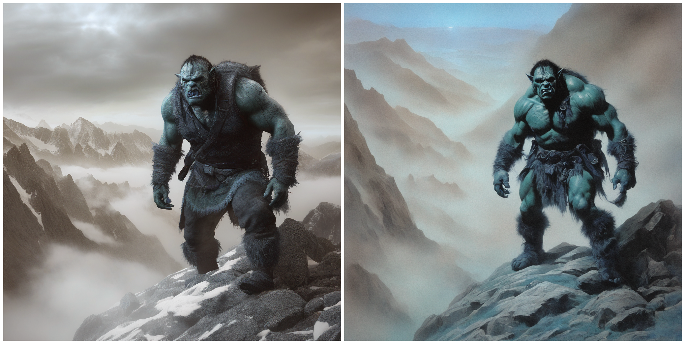
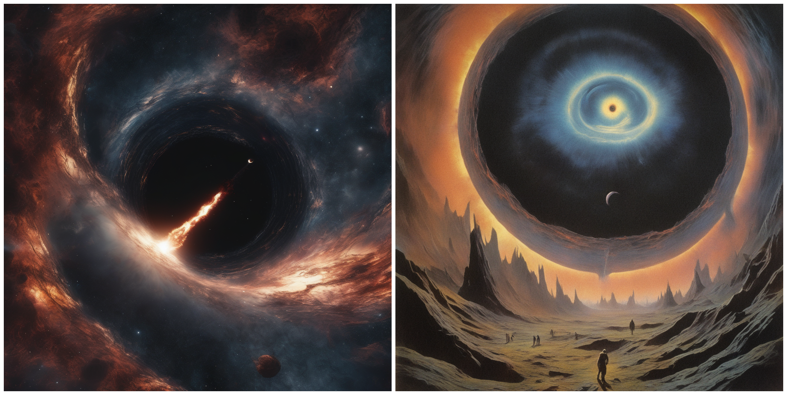
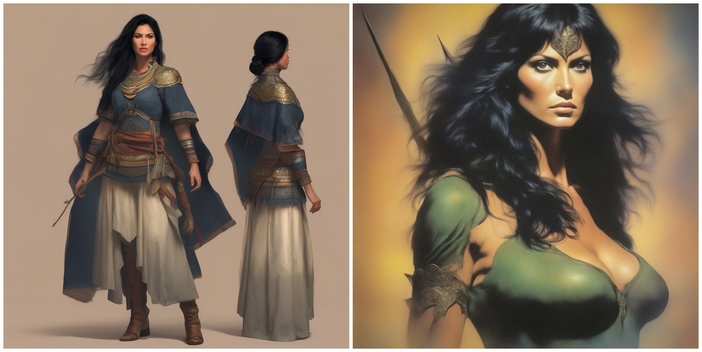

# SDFT
## Overview

SDFT is a self-educational project, aimed to overview main Stable Diffusion fine-tuning techniques.
Stable Diffusion implementation is taken from HuggingFace diffusers library.

Techniques to overview:
- [ ] [Low-Rank Adaptation](https://arxiv.org/abs/2106.09685)
- [ ] [Textual Inversion](https://textual-inversion.github.io/)
- [ ] [DreamBooth](https://dreambooth.github.io/)

## Table of Contents
* Overview
* Dataset
* Techniques

## Dataset
All fine-tuning techniques were performed on a hand-built toy dataset named "Dark Fantasy". The dataset was collected using fine-grained prompts with the Stable Diffusion XL Base-1.0 model from StabilityAI to generate dark-fantasy-like images in a style reminiscent of the 1970s and 1980s. The goal is to demonstrate how all the techniques outlined work on this dataset.

The dataset could be found under the `datasets/` directory.

## Techniques
### LoRA 
#### Usage

To fine-tune SDXL with LoRA:
```bash 
accelerate launch train_lora_sdxl.py \
    --pretrained_model_name_or_path=stabilityai/stable-diffusion-xl-base-1.0 \
    --pretrained_vae_model_name_or_path=madebyollin/sdxl-vae-fp16-fix \
    --allow_tf32 \
    --mixed_precision="fp16" \
    --rank=32 \
    --train_data_dir=datasets/dark_fantasy/ \
    --caption_column="text" \
    --dataloader_num_workers=16 \
    --resolution=512 \
    --use_center_crop \
    --use_random_flip \
    --train_batch_size=2 \
    --gradient_accumulation_steps=4 --gradient_checkpointing \
    --max_train_steps=1500 \
    --learning_rate=1e-04 \
    --max_grad_norm=5 \
    --lr_scheduler="cosine_with_restarts" \
    --lr_warmup_steps=100 \
    --output_dir=runs/lora_run/ \
    --checkpointing_steps=100 \
    --validation_epochs=10 \
    --num_validation_images=4 \
    --save_images_on_disk \
    --validation_prompt="A picture of a misterious figure in cape, back view." \
    --logging_dir="logs" \
    --seed=1337
```

To run inference with LoRA checkpoint:
```bash
accelerate launch run_lora_inference.py \
    --pretrained_model_name_or_path=stabilityai/stable-diffusion-xl-base-1.0 \
    --pretrained_vae_model_name_or_path=madebyollin/sdxl-vae-fp16-fix \
    --output_dir=runs/lora_v1/ \
    --lora_checkpoint_path=runs/lora_run/checkpoint-100/ \
    --resolution=1024 \
    --num_images_to_generate=5 \
    --guidance_scale=5.0 \
    --num_inference_steps=40 \
    --prompt="A picture of a misterious figure in cape, back view." \
    --negative_prompt="logo, watermark, text, blurry" \
    --seed=1337
```

#### Results

No LoRA - LoRA images comparison. Pairs of images were generated using the same latents.

> `"A picture of a heavy red Kenworth truck riding in the night across the abanoned city streets."`

<!-- #region -->
<p align="center">

</p>
<!-- #endregion -->

> `"A picture of a wounded orc warrior, climbing in misty mountains, front view, exhausted face, looking at the camera."`

<!-- #region -->
<p align="center">

</p>
<!-- #endregion -->

> `"A picture of space rocket launching, Earth on the background, candid photo."`

<!-- #region -->
<p align="center">

</p>
<!-- #endregion -->

> `"A picture of a supermassive black hole, devouring the galaxy, cinematic picture"`

<!-- #region -->
<p align="center">

</p>
<!-- #endregion -->

> `"A picture of a human woman warrior, black hair, looking at the camera, front view."`

<!-- #region -->
<p align="center">

</p>
<!-- #endregion -->

---


